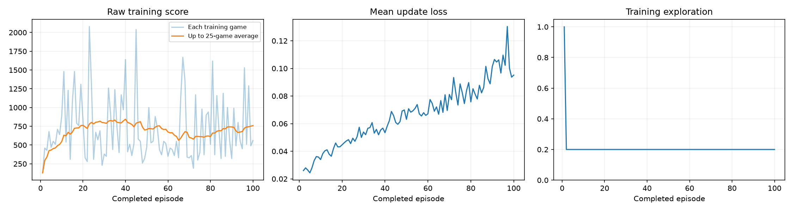
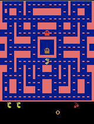
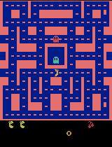
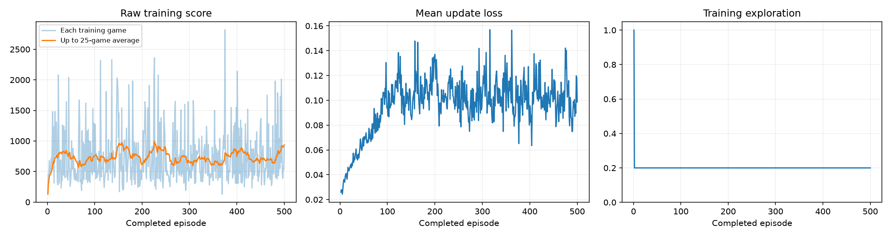
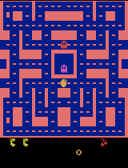

# Training a Ms. Pac-Man agent (Class 3)

I trained a Deep Q-Network (DQN) — a neural network that learns, by trial and error, how many points each joystick move is likely to earn — to play the Atari game Ms. Pac-Man. I used the supplied class notebook, changed only the three required settings, and compared the agent's scores on the same five test games before and after training.

**Result in one sentence:** after 100 training games the agent's mean evaluation score went from **492.0 to 504.0 (+12.0)**, a change too small to show that it learned to play better.

**Main submitted result:** the 100-episode run below. I also ran my proposed next experiment afterwards: the same settings with **500 episodes**. That run scored **480.0**, lower than both the untrained network and the 100-episode agent. Its results are reported in full in [Next experiment I ran: 500 episodes](#next-experiment-i-ran-500-episodes).

- Executed notebook with all outputs: [`pacman_dqn.ipynb`](pacman_dqn.ipynb). GitHub's notebook viewer can't play animated GIFs, so the gameplay clips show there as `<IPython.display.Image object>`. The same clips are embedded [below](#gameplay) and saved in [`results/gifs/`](results/gifs/).
- Evidence files: [`results/`](results/)

---

## How to open and run the notebook

**Google Colab**
1. Open [`pacman_dqn.ipynb`](pacman_dqn.ipynb) in Colab (File → Upload notebook, or open it from GitHub).
2. Runtime → Change runtime type → select a GPU if available.
3. Runtime → Run all. Setup installs the packages automatically.
4. Download the ZIP of the `pacman_runs/` folder before the session ends.

**Local (macOS/Linux, Python 3.11–3.13)**
```bash
python3 -m venv .venv
.venv/bin/pip install jupyter
.venv/bin/jupyter notebook pacman_dqn.ipynb
```
Then choose Run All. The first code cells install PyTorch, Gymnasium, and the Atari emulator.

To reproduce my run, keep the settings in section 1 as listed below. Results can vary slightly on different hardware even with the same seed.

---

## My three hyperparameters

| Setting | Value | Why I chose it |
|---|---|---|
| Exploration | `0.20` | I started from the notebook's suggested value. One random move in five lets the agent keep discovering new paths while mostly using what it has learned. Starting from the standard value also gives me a baseline to compare later experiments against. |
| Episodes | `100` | I first ran 5 games only to check that everything worked. The score dropped (492 → 274), which made sense with so little practice. So I moved up to the notebook's suggested 100 games to give the agent a real chance to learn. |
| Learning rate | `0.0001` | I kept the suggested value because small, steady updates are less likely to make training fall apart. That way, if the agent didn't improve, I could rule out an unstable learning rate as the cause. |

All other settings, including the evaluation settings (the same five game seeds `101, 202, 303, 404, 505`, 5% random moves, and the time limit), were left unchanged. The full list is in [`results/config.json`](results/config.json).

---

## What I expected

I expected the mean evaluation score to **go up a lot**. 100 games is 20 times more practice than my 5-game setup check, and I thought that many games would be enough for the agent to learn basic habits, like eating dots and avoiding ghosts. That turned out to be wrong: the mean rose by only 12 points.

---

## What happened

### Training budget (actual)

| Measure | Value |
|---|---|
| Completed episodes | 100 of 100 (run completed, not interrupted) |
| Agent decisions | 61,219 |
| Learning updates | 15,055 |
| Elapsed time | 224.7 seconds (about 3.7 minutes, including progress samples) |
| Hardware | Apple M4 laptop, using the Apple GPU (MPS) |
| Software | Python 3.12.14, PyTorch 2.14.0, Gymnasium 1.3.0, ale-py 0.11.2 |

Source: [`results/training_summary.json`](results/training_summary.json), [`results/config.json`](results/config.json), [`results/training.csv`](results/training.csv).

The first 1,000 decisions were random warm-up with no learning, which covered all of game 1 and part of game 2. Every training game ended in game over; none reached the time limit.

### Before/after evaluation (same five games)

| Game (seed) | Untrained | Trained (100 games) |
|---|---|---|
| 1 (101) | 350 | 280 |
| 2 (202) | 500 | 550 |
| 3 (303) | 320 | 310 |
| 4 (404) | 800 | 620 |
| 5 (505) | 490 | 760 |
| **Mean** | **492.0** | **504.0** |

Change in mean score: **+12.0**. The trained agent did better in 2 games and worse in 3. No evaluation game reached the time limit. Full data: [`results/comparison.json`](results/comparison.json).

### Training plot



- **Raw training score:** the 25-game average rose from 130 after game 1 to a peak of about 845 around game 40, dipped to about 560 around game 65, and ended at 758. Single games varied widely (190 to 2,080).
- **Mean update loss** (how far the network's predictions were from its learning targets) rose steadily from about 0.03 to about 0.10. This does not by itself mean training failed. As the agent starts expecting more future points, its targets grow and so does the error. But it also does not show improvement.
- **Training exploration** was 100% during warm-up, then stayed at 20% as designed.

### Gameplay

GIFs show at most the first 20 seconds of a game, sped up 4×. The scores cover the whole game.

> **Note on the notebook view:** the executed notebook contains all six gameplay GIFs. GitHub's notebook viewer does not display animated GIF outputs, though, and shows `<IPython.display.Image object>` in their place. They play normally when the notebook is opened in Jupyter, VS Code, or Colab. The same files are shown below and saved in [`results/gifs/`](results/gifs/). The notebook's outputs were left exactly as the run produced them.

| Untrained | Best trained game (game 5, score 760) |
|---|---|
|  |  |

**Progress samples.** Each one plays evaluation game 1 (seed 101). The untrained agent scored 350 on that game.

| After 25 games (390) | After 50 games (270) | After 75 games (200) | After 100 games (280) |
|---|---|---|---|
|  |  |  |  |

Scores from [`results/demo_scores.json`](results/demo_scores.json).

**What I noticed.** Times below are approximate, measured in game time.
- **Untrained, game 1:** Ms. Pac-Man lost her first life about 18 seconds in. Her score kept climbing steadily, reaching 350 by the end of the clip.
- **After 100 games, same game 1:** she lost her first life sooner, about 12 seconds in. After that her score stayed at 200 for the rest of the clip, about the last 7 seconds, so she earned no points in that stretch.
- **Best trained game (game 5):** she moved into the lower part of the maze and reached 300 points by the end of the clip, losing her first life about 15 seconds in. This is a different game from game 1, so it can't be compared directly with the untrained clip.

The gameplay agrees with the scores. The trained agent doesn't show a clear new skill, like dodging ghosts or clearing one area at a time, and on game 1 it actually did worse than the untrained network.

### Interpretation

The agent's practice scores rose early in training, which suggests it picked up something. But the fair test, the same five games before and after training, shows no clear improvement: +12 points on average, with large swings between individual games. The progress samples on game 1 were all at or below the untrained score. I do not have evidence that this agent plays Ms. Pac-Man better than the untrained network.

---

## How the agent works (plain language)

- **Observations — what it sees:** the last **four game screens**, each shrunk to 84 × 84 pixels in grayscale. One screen shows where things are; four in a row also show which way they are moving.
- **Actions — what it can do:** **9 joystick moves**: no move, up, down, left, right, and the four diagonals.
- **Rewards — how it is scored:** **game points**, for eating dots, power pellets, fruit, and ghosts. During learning each reward is capped between −1 and +1 so large bonuses don't overwhelm the updates. All scores reported here are the real game points.
- **How it learns:** the network guesses how many future points each move will lead to. After each move it compares that guess with the points it actually got plus its estimate for the next screen, and nudges itself to be less wrong. It learns from random batches of 32 past moves, drawn from a memory of the last 5,000.

---

## Limitation

**The training budget was very small.** 15,055 learning updates from about 61,000 decisions is a tiny fraction of the millions of decisions typically used to train Atari agents. With this little practice, the agent's behavior is mostly still noise. Only five test games also means one lucky or unlucky game can move the mean by more than 100 points.

## Next experiment I ran: 500 episodes

After the 100-episode run, I **changed only the number of episodes, from 100 to 500**, keeping exploration at 0.20, the learning rate at 0.0001, and every evaluation setting the same. The practice-score average in the 100-episode run was still moving up and down rather than settling, and the agent had very few learning updates. Five times more training tests whether the lack of improvement came from too little practice rather than from the other two settings.

**Prediction:** more practice would raise the mean evaluation score above 504.

### Training budget (actual)

| Measure | Value |
|---|---|
| Completed episodes | 500 of 500 (run completed, not interrupted) |
| Agent decisions | 307,614 |
| Learning updates | 76,654 |
| Elapsed time | 1,187.2 seconds (about 20 minutes, including progress samples) |
| Hardware | Same Apple M4 laptop, Apple GPU (MPS) |

### Before/after evaluation (same five games)

| Game (seed) | Untrained | After 100 episodes | After 500 episodes |
|---|---|---|---|
| 1 (101) | 350 | 280 | 330 |
| 2 (202) | 500 | 550 | 80 |
| 3 (303) | 320 | 310 | 460 |
| 4 (404) | 800 | 620 | 790 |
| 5 (505) | 490 | 760 | 740 |
| **Mean** | **492.0** | **504.0** | **480.0** |

Change in mean score after 500 episodes: **−12.0** compared with the untrained network, and **−24.0** compared with the 100-episode agent. No evaluation game reached the time limit. Full data: [`comparison.json`](results/next-experiment-500-episodes/comparison.json).



| Best trained game after 500 episodes (game 4, score 790) | Progress sample after 325 episodes (game 1, score 3,120) | Progress sample after 500 episodes (game 1, score 330) |
|---|---|---|
|  |  |  |

### What happened

- **More practice did not improve the evaluation score.** The 500-episode agent beat the 100-episode agent in 3 of 5 games, but it scored only 80 in game 2. Its mean, 480.0, was the lowest of the three.
- **Practice scores never trended upward.** The 25-game average moved between roughly 600 and 1,000 for all 500 episodes.
- **Loss stopped rising.** It climbed to about 0.10 by episode 100, then stayed around that level. The network's predictions stabilised, but its play did not improve.
- **Play was unstable.** The progress samples on game 1 ranged from 200 to 3,120. One checkpoint (episode 325) played that game very well, but later checkpoints did not keep that skill.
- The first 100 episodes of this run matched the 100-episode run exactly, because both used the same seed. The two runs differ only in the extra 400 episodes.

**My prediction was wrong.** Too little practice does not explain the lack of improvement, at least not on its own.

Evidence: [executed 500-episode notebook](results/next-experiment-500-episodes/pacman_dqn_500_episodes.ipynb), [`config.json`](results/next-experiment-500-episodes/config.json), [`training.csv`](results/next-experiment-500-episodes/training.csv), [`training_summary.json`](results/next-experiment-500-episodes/training_summary.json), [`demo_scores.json`](results/next-experiment-500-episodes/demo_scores.json). The full output folder with all 22 GIFs and checkpoints is in the release (see [Files](#files)).

## Proposed next experiment

**Change only exploration, from 0.20 to 0.10**, keeping 500 episodes and the learning rate at 0.0001. With 20% random moves, many training games are cut short by random mistakes rather than by the agent's own choices, while evaluation uses only 5% random moves. Halving exploration tests whether practice that looks more like the evaluation games produces a more consistent agent.

---

## Files

| File | What it contains |
|---|---|
| [`pacman_dqn.ipynb`](pacman_dqn.ipynb) | The notebook saved after my final 100-episode run, with all outputs |
| [`results/config.json`](results/config.json) | All settings, hardware, and package versions |
| [`results/training.csv`](results/training.csv) | One row per training game: score, decisions, loss, time |
| [`results/training_summary.json`](results/training_summary.json) | Completed episodes, decisions, learning updates, time |
| [`results/comparison.json`](results/comparison.json) | All before/after evaluation scores |
| [`results/baseline.json`](results/baseline.json) | Untrained evaluation scores |
| [`results/demo_scores.json`](results/demo_scores.json) | Scores for the progress samples |
| [`results/training_dashboard.png`](results/training_dashboard.png) | Training plot |
| [`results/gifs/`](results/gifs/) | Untrained, progress, and best trained gameplay |
| [`results/next-experiment-500-episodes/`](results/next-experiment-500-episodes/) | The 500-episode follow-up run: executed notebook, settings, log, scores, plot, and selected GIFs |

**Model checkpoints** (`untrained.pt`, `episode_0025.pt` … `episode_0100.pt`, `trained.pt`; 6.4 MB each) are not in this repository to keep it small. They are included in the full results ZIP attached to the **[v1.0-results release](https://github.com/kaylinyu-rgb/pacman-dqn-submission/releases/tag/v1.0-results)**:

| Release file | What it is |
|---|---|
| `final-run-100-episodes_20260912_160018.zip` (37.6 MB) | **The graded run.** The complete `pacman_runs/` folder the notebook produced: all files in `results/` plus all six checkpoints. |
| `next-experiment-500-episodes_20260912_165849.zip` (137.9 MB) | The 500-episode follow-up experiment: its complete output folder, including all 22 GIFs and 22 checkpoints. |
| `setup-check-5-episodes_20260912_155642.zip` (12.5 MB) | The 5-episode setup check only; not part of the results above. |

To reload a checkpoint, unzip the final-run file and load `trained.pt` the way section 6a of the notebook does.

A separate 5-episode run was used only as a setup check and is not part of these results.
